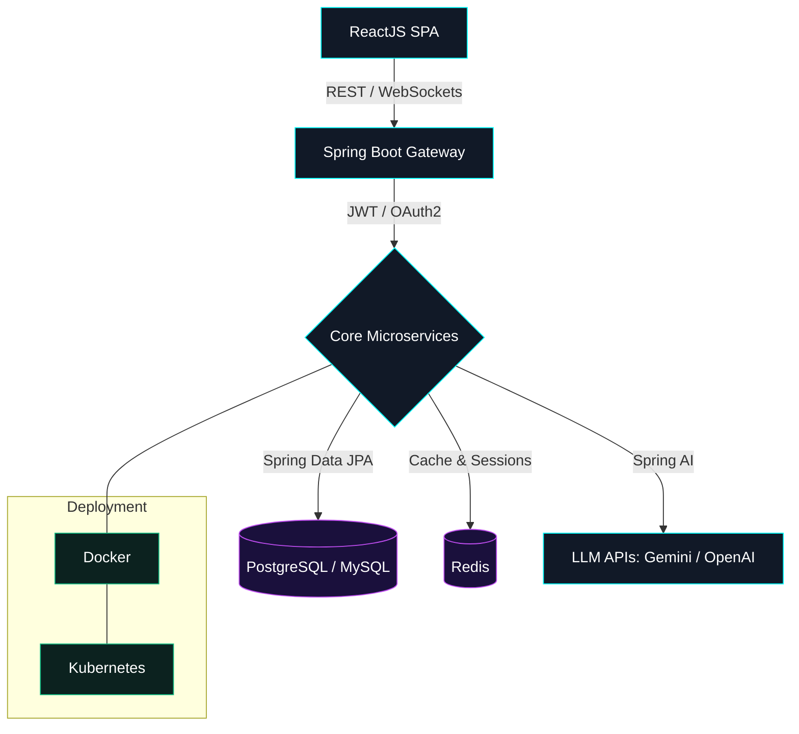

<div align="center">


<a href="https://www.linkedin.com/in/ishan-maharwade-635475250" target="_blank">
  
</a>
<a href="mailto:ishanmaharwade01@gmail.com">
  
</a>
<a href="https://github.com/Ishan4580">
  
</a>

<br/>


</div>

<br/>

### 👨‍💻 A little about me

```yaml
name: Ishan Maharwade
role: Full Stack Java Developer (AI)
focus: Scalable microservices + Generative AI integrations (RAG, LLMs, semantic search)
currently_learning: [Reactive Spring, Advanced Prompt Engineering, Spring AI]
ask_me_about: [Java REST APIs, Spring Security (JWT/OAuth2), React state management, Spring AI]
fun_fact: I enjoy turning enterprise backends into AI-powered products 🚀
```

<br/>

## 🏗️ How I Build AI-Integrated Platforms



<br/>

## 🧰 Tech Stack

<div align="center">

**Languages**


**Backend**


**Frontend**


**Databases**


**DevOps & Tools**


</div>

<br/>

<details>
<summary><b>🤖 Sample: Spring AI Controller</b></summary>
<br/>

```java
@RestController
@RequestMapping("/api/ai")
public class GeminiController {

    private final ChatClient chatClient;

    public GeminiController(ChatClient.Builder builder) {
        this.chatClient = builder.build();
    }

    @GetMapping("/generate")
    public ResponseEntity<String> generateResponse(@RequestParam String prompt) {
        String response = chatClient.prompt()
                .user(prompt)
                .call()
                .content();
        return ResponseEntity.ok(response);
    }
}
```

</details>

<br/>

## 📊 GitHub Stats

<div align="center">


</div>

<br/>

## 📅 Contribution Graph

<div align="center">

</div>

<br/>

## 🤝 Let's Connect

<div align="center">

<a href="https://www.linkedin.com/in/ishan-maharwade-635475250" target="_blank">
  
</a>
<a href="mailto:ishanmaharwade01@gmail.com">
  
</a>
<a href="https://www.buymeacoffee.com/chamidudili" target="_blank">
  
</a>

<br/><br/>

<picture>
  <source media="(prefers-color-scheme: dark)" srcset="https://raw.githubusercontent.com/tobiasmeyhoefer/tobiasmeyhoefer/output/github-snake-dark.svg" />
  <source media="(prefers-color-scheme: light)" srcset="https://raw.githubusercontent.com/tobiasmeyhoefer/tobiasmeyhoefer/output/github-snake.svg" />
  
</picture>

</div>
