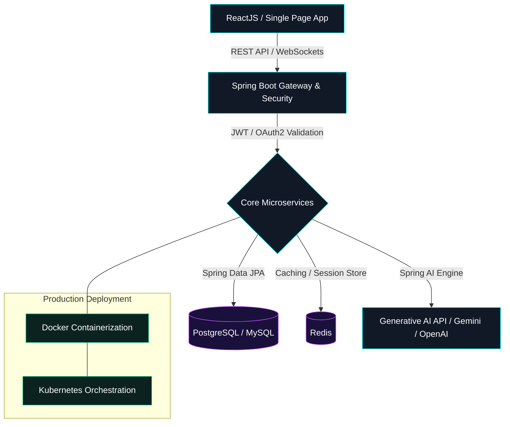

# 🌟 Ishan Maharwade | Full Stack Developer (AI)


<p align="center">
  <a href="https://github.com/Ishan4580">
    
  </a>
  &nbsp;&nbsp;
  <a href="https://github.com/Ishan4580">
    
  </a>
  &nbsp;&nbsp;
  <a href="https://streak-stats.demolab.com/?user=Ishan4580&theme=dark">
    
  </a>
</p>
---

## 🌱 About Me
I am a **Full Stack Java Developer** specializing in building highly scalable, secure microservice architectures and integrating **Generative AI** features (such as semantic search, LLM integrations, and RAG pipelines) directly into enterprise-grade applications.

* 🌱 **Currently diving deep into**: Advanced Spring Boot design patterns, reactive programming, and Prompt Engineering.
* 💬 **Ask me about**: Java REST API design, Spring Security (JWT, OAuth2), React components state management, and Spring AI.
* 📫 **Reach out directly**: [ishanmaharwade01@gmail.com](mailto:ishanmaharwade01@gmail.com)

---

## 🎨 Enterprise System Architecture (Typical AI-Integrated Stack)
*Here is a standard architecture of full-stack AI platforms that I build and deploy. (Hover over nodes to inspect flow)*



---

## 📂 Developer Ecosystem Details
*Click on the sections below to expand my developer toolbox:*

<details open>
<summary><b>🛠️ 🧰 Languages & Tools</b></summary>
<br/>

### 💻 Programming Languages & Proficiencies
| Language | Focus Area | Level (Simulated) |
| :--- | :--- | :--- |
| **Java** | Core OOP, Spring Context, Multi-threading, Microservices | `[████████████████░░░░] 80%` |
| **JavaScript** | Component Lifecycle, Hooks, ES6, React State | `[███████████████░░░░░] 78%` |
| **C++** | Data Structures, Algorithm Optimization, Complex Logic | `[██████████████░░░░░░] 70%` |
| **C#** | OOP Concepts, CLI Tooling, Logic Pipelines | `[█████████████░░░░░░░] 65%` |

### ⚙️ Backend Frameworks & Systems
<p align="left">
  
  
  
</p>

### 🎨 Frontend Frameworks & Style Libraries
<p align="left">
  
  
  
  
  
</p>

### 🗄️ Database Management Systems
<p align="left">
  
  
  
  
  
</p>

### ☁️ DevOps, Containers & Tools
<p align="left">
  
  
  
  
  
  
</p>

</details>

<details>
<summary><b>🧠 🤖 Generative AI Controller Implementation (Sample Code)</b></summary>
<br/>

*Here is a snippet showing how I integrate AI into Spring Boot controllers to process prompt templates and generate structured JSON responses:*

```java
@RestController
@RequestMapping("/api/ai")
public class GeminiController {

    private final ChatClient chatClient;

    public GeminiController(ChatClient.Builder builder) {
        this.chatClient = builder.build();
    }

    @GetMapping("/generate")
    public ResponseEntity<String> generateResponse(@RequestParam String prompt) {
        String response = chatClient.prompt()
                .user(prompt)
                .call()
                .content();
        return ResponseEntity.ok(response);
    }
}
```

</details>

<details>
<summary><b>📊 📈 GitHub Metrics & Stats</b></summary>
<br/>

<div align="center">
  <table border="0">
    <tr>
      <td width="50%" align="center">
        <a href="https://github.com/Ishan4580">
          
        </a>
      </td>
      <td width="50%" align="center">
        
      </td>
    </tr>
    <tr>
      <td colspan="2" align="center">
        
      </td>
    </tr>
    <tr>
      <td align="center">
        <a href="https://github.com/Ishan4580">
          
        </a>
      </td>
      <td align="center">
        
      </td>
    </tr>
    <tr>
      <td colspan="2" align="center">
        
      </td>
    </tr>
  </table>
</div>

</details>

---

## 📅 My GitHub Contributions
<p align="center">
  
</p>

---

## 🔗 Connect & Support

<p align="center">
  <a href="https://www.linkedin.com/in/ishan-maharwade-635475250" target="_blank">
    
  </a>
  &nbsp;&nbsp;
  <a href="mailto:ishanmaharwade01@gmail.com">
    
  </a>
</p>

<p align="center">
  <a href="https://www.buymeacoffee.com/chamidudili" target="_blank">
    
  </a>
</p>

<p align="center">
  <picture>
    <source media="(prefers-color-scheme: dark)" srcset="https://raw.githubusercontent.com/tobiasmeyhoefer/tobiasmeyhoefer/output/github-snake-dark.svg" />
    <source media="(prefers-color-scheme: light)" srcset="https://raw.githubusercontent.com/tobiasmeyhoefer/tobiasmeyhoefer/output/github-snake.svg" />
    
  </picture>
</p>
